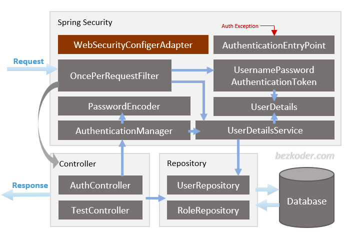

# Spring Boot Security Jwt Authentication
**Spring Security**

(WebSecurityConfigurerAdapter is deprecated from Spring 2.7.0, you can check the source code for update. More details at:
WebSecurityConfigurerAdapter Deprecated in Spring Boot)
– **`WebSecurityConfigurerAdapter`** is the crux of our security implementation. It provides HttpSecurity configurations to configure cors, csrf, session management, rules for protected resources. We can also extend and customize the default configuration that contains the elements below.

– **`UserDetailsService`** interface has a method to load User by username and returns a UserDetails object that Spring Security can use for authentication and validation.

– **`UserDetails`** contains necessary information (such as: username, password, authorities) to build an Authentication object.

– **`UsernamePasswordAuthenticationToken`** gets {username, password} from login Request, AuthenticationManager will use it to authenticate a login account.

– **`AuthenticationManager`** has a DaoAuthenticationProvider (with help of UserDetailsService & PasswordEncoder) to validate UsernamePasswordAuthenticationToken object. If successful, AuthenticationManager returns a fully populated Authentication object (including granted authorities).

– **`OncePerRequestFilter`** makes a single execution for each request to our API. It provides a doFilterInternal() method that we will implement parsing & validating JWT, loading User details (using UserDetailsService), checking Authorizaion (using UsernamePasswordAuthenticationToken).

– **`AuthenticationEntryPoint`** will catch authentication error.

Repository contains UserRepository & RoleRepository to work with Database, will be imported into Controller.

[Spring Boot Security With JWT Example](https://www.bezkoder.com/spring-boot-jwt-authentication/).

